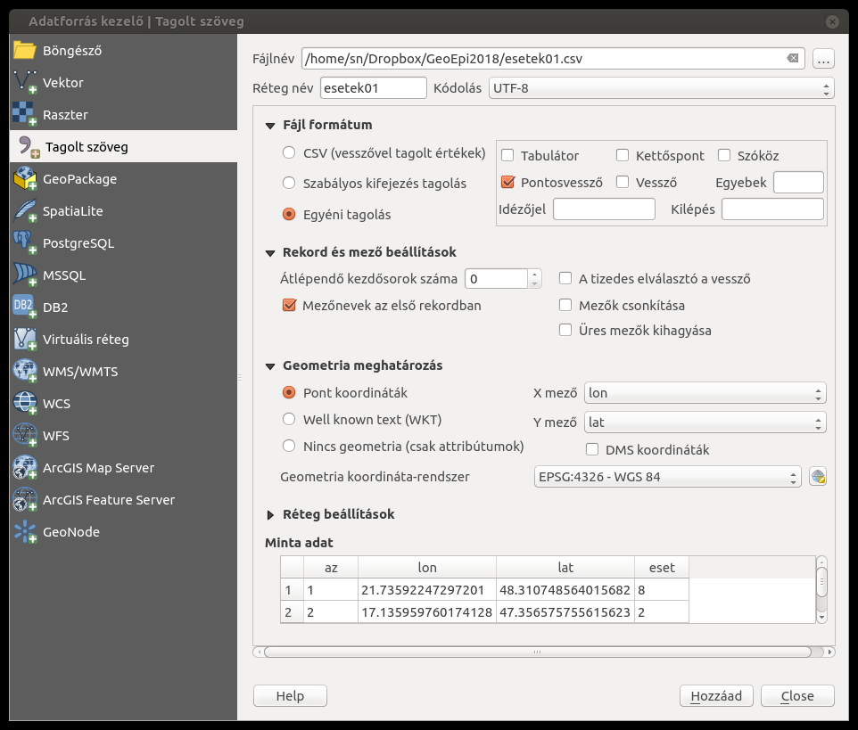
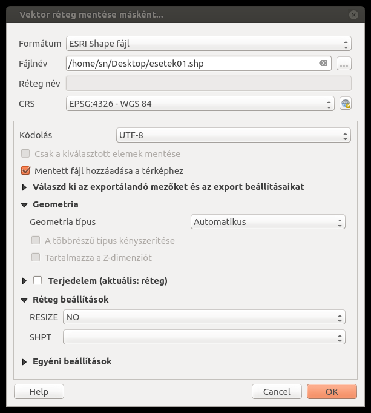
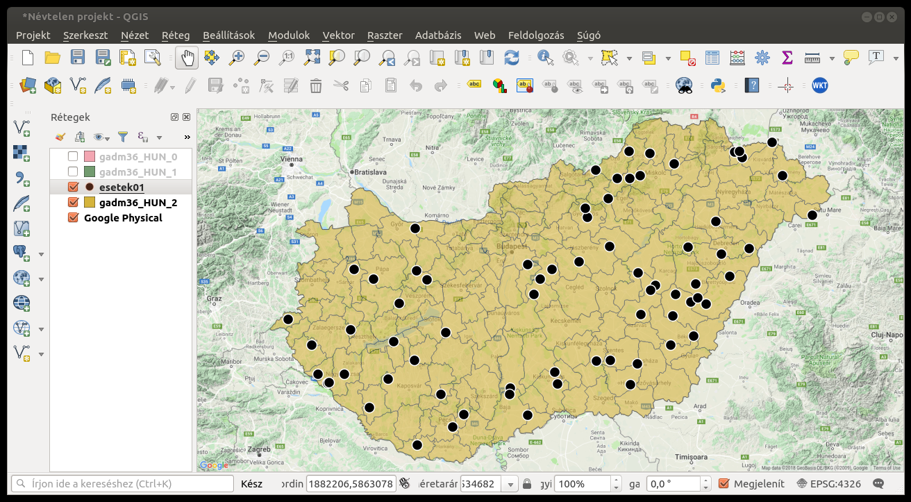
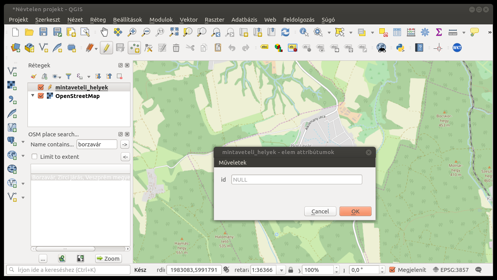
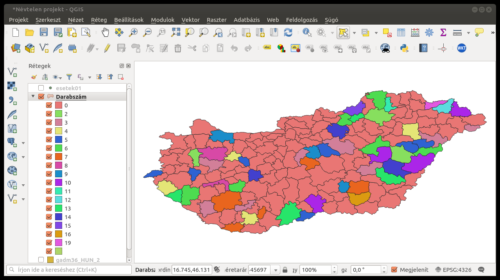
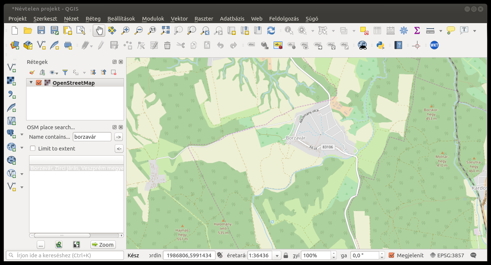

Quantum GIS
===========

A `Quantum GIS (QGIS) <https://www.qgis.org>`__ nyílt forráskódú,
ingyenes földrajzi információs rendszer (GIS), amely különböző operációs
környezetekben (MS Windows, Mac OS X, Linux, BSD, Android) is
`telepíthető <https://www.qgis.org/en/site/forusers/download.html>`__. A
szoftvert széles körben használják különböző területeken, így
állatorvosi epidemiológiai munkában, elemzésekben is (Solymosi et al.,
2013). Az eszköz nagy előnye, hogy kiegészítő modulokat (plugin) lehet
hozzá fejleszteni, telepíteni speciális feladatok megvalósítása céljából
(Solymosi et al., 2010, 2013). Ebben a fejezetben a QGIS használatát
olyan példákon keresztül mutatjuk be, amelyek gyakrabban fordulnak elő
az állatorvosi epidemiológiai vizsgálatokban.

Digitális térképek
------------------

A QGIS, mint ahogy a többi GIS is, különböző digitális térképeket kezel.
A térképeket tárolhatjuk fájlként vagy adatbázisban. A digitális térkép
két alaptípusa a vektor- és a pixelgrafikus térkép. A vektorgrafikus
térképek legelterjedtebb fájlformátuma az ún. `ESRI
shapefile <https://www.esri.com/library/whitepapers/pdfs/shapefile.pdf>`__.
Mivel ennek a használata a legegyszerűbb, első példáinkban ilyen
állományokat fogunk használni.

Digitális térképeket különböző forrásokból szerezhetünk be. Lehetnek
meglehetősen költségesek, de szerencsére számos ingyenes térkép is
elérhető. Magyarország országos, megyei és kistérségi vektorgrafikus
térképét ingyenesen letölthetjük pl. a `Global Administrative
Areas <http://www.gadm.org/country>`__ honlapról. Ezen az oldalon az
ország nevének megadása után ki kell választanunk a letöltendő
fájlformátumot (``Shapefile``). Az \ ``OK`` gomb megnyomása után a
megjelenő térkép alatti ``download`` linkre kattintva töltődik le a
zippelt állomány. Kitömörítése után három térképet (``gadm36_HUN_0``,
``gadm36_HUN_1``, ``gadm36_HUN_2``) láthatunk, mindegyik térképet
hat-hat különböző kiterjesztésű (``.cpg``, ``.csv``, ``.dbf``, ``.prj``,
``.shp``, ``.shx``) fájlban tárolva.

A QGIS ``Réteg`` menüjéből, a ``Réteg hozzáadás`` menülistából válasszuk
ki a ``Vektor réteg hozzáadás...`` menüelemet. A megjelenő
``Vektor réteg hozzáadása`` ablakban hagyjuk kijelölve a *Fájl* típust,
illetve a ``Kódolás`` legördülő mezőben a ``System`` értéket.
A \ ``Tallóz`` gombra kattintva megjelenő
``Vektor réteg megadása OGR támogatással`` című fájlmenedzser fájltípus
választó legördülő mezőjében az alapértelmezett ``Minden fájl`` érték
helyett válasszuk ki az ``ESRI Shape fájl`` elemet. Ezek után jelöljük
ki a ``gadm36_HUN_0.shp``, ``gadm36_HUN_1.shp`` és ``gadm36_HUN_2.shp``
fájlokat. A \ ``Megnyitás`` gombra kattintva visszatértünk a
``Vektor réteg hozzáadása`` ablakhoz, ahol újra nyomjuk meg a
``Megnyitás`` gombot, ami az alábbi ábrához hasonló képernyőt
eredményez.

| |qgis01|
| Az ábrán látható, hogy a három shape-fájl betöltésével három réteget
  kaptunk, amelyek nevei a QGIS bal oldalán látható ``Rétegek`` listában
  olvashatók. A térképeink közül a megnyitáskor elsőként megadott
  ``gadm36_HUN_0`` réteg van legfelül, így a másik két réteget
  eltakarja. Ha ennek a rétegnek a neve mellett levő pipajelet
  kikapcsoljuk az egérrel, akkor a réteglista második elemét, a
  ``gadm36_HUN_1`` réteget látjuk, ami a magyarországi megyék
  poligonjait tartalmazza. Ha a ``gadm36_HUN_0`` láthatóságának
  kikapcsolásához hasonlóan a ``gadm36_HUN_1`` réteget is elrejtjük,
  akkor a ``gadm36_HUN_2`` nevű, a magyarországi kistérségeit tartalmazó
  réteget láthatjuk. A fájlok betöltésekor a QGIS automatikusan színezi
  a térképeket. Ha meg szeretnénk változtatni a kijelölt réteg
  megjelenését, akkor azt a ``Réteg`` menüből a ``Tulajdonságok...``
  menüpontra kattintva megjelenő ``Réteg tulajdonságok`` ablak
  ``Jelrendszer`` fülének beállítási lehetőségeivel tehetjük meg. Ezen a
  felületen a színek mellett a réteg átlátszóságát, mintázatát is
  beállíthatjuk.

| |Réteg-tulajdonságok beállítását segítő ablak|
| A vektorgrafikus térképek nem csak a topológiát tartalmazzák, hanem az
  egyes objektumokhoz (pont, vonal, poligon) tartozó ún. leíró adatokat
  is, amit a QGIS-ben az *attribútum* táblán keresztül tekinthetünk meg.
  Ezt a ``Réteg`` menüből az ``Attribútum tábla megnyitása`` menüelem
  segítségével nyerhetjük ki a térképből.

| |image|
| Az ábrán bemutatott táblázatban az egyes sorok a térképet alkotó egyes
  poligonokhoz tartoznak. Az ablak fejlécében olvasható, hogy 168
  objektumhoz (*Features*) tartozó adatokat tartalmaz a kijelölt térképi
  réteg. Ha a táblázatban valamely mezőben a magyar ékezetek hiányoznak
  a szavakból, annak lehet az oka, hogy a shape-fájlokat más kódolással
  nyitottuk meg, mint amilyenben azokat készítették.

Ennek korrigálására nyissuk meg a ``Réteg tulajdonságok`` ablakot, abban
pedig válasszuk ki az ``Általános`` fület. Az így látható felületen a
``Karakter kódolás`` legördülő mezőben válasszuk ki a ``ISO-8859-2``
vagy a ``latin2`` elemet, majd kattintsunk az ``OK`` gombra. Ha ezek
után újra megnyitjuk az attribútum-táblázatot, akkor a magyar szövegek
már helyesen jelennek meg.

Ha az attribútum-táblázatban sorokat jelölünk ki, akkor az azokhoz
tartozó objektumok is kijelöltté válnak a térképen. Ugyanígy, ha a
térképen kijelölünk poligonokat, akkor a hozzájuk tartozó sorok a
táblázatban is kijelölődnek.

Az egyes objektumokra vonatkozó adatokat kiírathatjuk úgy is, hogy a
``Nézet`` menüből az ``Elem azonosítás`` menüelemet aktiválva a
megváltozott egérkurzorral az objektumra kattintunk. Ekkor az
``Azonosítás eredménye`` táblázatban kiíródnak az objektumhoz tartozó
értékek.

Modulok
-------

Ahogy említettük a fejezet elején, a QGIS alaptelepítésében elérhető
funkciók mellett számos továbbit építhetünk be a QGIS-be modulok
segítségével. A modulok telepítésének módja attól függ, hogy milyen
programozási nyelvet használtak fejlesztésükben. QGIS modulokat vagy
Python, vagy C++ nyelven lehet fejleszteni. Az előző esetén a telepítés
egyszerű, míg utóbbi esetében bonyolultabb. Mivel a legtöbb modult
Pythonban fejlesztik, itt csak ezek telepítését mutatjuk be. Ehhez a
``Modul`` menü ``Modul telepítés és kezelés`` elemére kell kattintanunk.
A megjelenő ``Modulok`` ablak segítségével kiválaszthatjuk a telepítendő
modult, majd a ``Modul telepítés`` gombra kattintva a QGIS letölti és
integrálja magába azt.

| |Modul-telepítő ablak|
| Telepítsük . ábrán bemutatott ``OpenLayers Plugin`` elnevezésű modult.
  A modulok egy része a ``Modul`` menübe telepítődik, mások a QGIS
  menürendszerének egyéb részeibe. Az itt telepített modul pl. a ``Web``
  menüben lesz elérhető. Ahol a ``OpenLayers plugin`` menülistából
  kiválaszthatunk és betölthetünk webes térképi állományokat, mint pl.
  *Google Maps* rétegeket. Ez utóbbira példa:

| |image|
| Ezen a térképen azon kívül, hogy egy újabb réteg is megjelenik,
  változás még, hogy a ``Réteg tulajdonságok`` ablakban átlátszóvá
  tettük a kistérségi réteget, így láthatóvá válik az alatta levő
  *Google* térképi réteg is.

A térképen további változás, hogy az új réteg betöltésével megváltozott
az ország ,,alakja”. Ha a korábbi térképpel összevetjük, akkor ez
egyértelmű. Ennek oka, hogy a térképek vetületi rendszere megváltozott.
Az aktuális vetületet az ``EPSG:`` címke utáni szám jelzi.
Az \ `*EPSG* <http://www.epsg.org/>`__ egy olyan rendszer, ami egy-egy
azonosító számmal azonosíthatóvá teszi a különféle földrajzi vetületi
rendszereket. A példánkban a *WGS84* vetület (``EPSG:4326``)
*WGS84/Pseudo Mercator* vetületbe (``EPSG:3857``) transzformálódott.

Betegség-előfordulás helyének térképezése
-----------------------------------------

Miután a digitális térképek kezelésének alapjait áttekintettük, olyan
betegség-előfordulási térképezési alappéldákat ismertetünk, amelyek
gyakrabban előfordulnak a geo-epidemiológiában.

1. eset
~~~~~~~

Tegyük fel, hogy olyan vizsgálatból származó adataink vannak, amelyeknél
minden vizsgálati ponthoz feljegyeztük az esetszámokat, illetve a
ponthoz GPS-koordinátákat. Mondjuk, hogy 70 pontból gyűjtöttünk
adatokat, ennek a táblázatnak az első sorai:

::

    # R

      az      lon      lat eset
    1  1 21.73592 48.31075    8
    2  2 17.13596 47.35658    2
    3  3 19.38684 47.27661    6
    4  4 17.89719 45.89536    7
    5  5 21.26695 47.23823    2
    6  6 21.39482 47.07300    3
    .  . .        .           .
    .  . .        .           .
    .  . .        .           .

Ilyen táblázatokat importálhatunk a QGIS-be, ehhez azonban előtte el
kell mentenünk azokat ún. vesszővel határolt formátumú (CSV) szöveges
`állományban <https://raw.githubusercontent.com/solymosin/geo-epi/master/ch01/esetek01.csv>`__.
Ezek után a QGIS ``Réteg``-menüjéből, a ``Réteg hozzáadás`` menülistából
a ``Tagolt szöveg réteg hozzáadás...`` menüelemet kiválasztva az
``Adatforrás kezelő`` ablak jelenik meg.

   Adatforrás kezelő

Az ablakban be kell állítanunk, hogy a mezőket milyen jel (pl.
pontosvessző) választja el. A \ ``Geometria`` részben meg kell adnunk,
hogy pontokról van szó, amelyek esetén a hosszúsági (``x mező``) és
szélességi (``y mező``) értékeit tartalmazó mezők nevét szintén ki kell
választanunk a mezőnevek közül. A vetületek közül az alapértelmezett
``EPSG:4326`` azonosítójú rendszert válasszuk ki, mivel az adatgyűjtés
során GPS WGS84 rendszerben adta meg a vizsgálati helyek geolokációját.

Az importált vizsgálati pontok rétegével gyarapodott térképünk – némi
színezés után – alább látható.

| |image|
| Meg kell jegyezni, hogy ez az új réteg még mindig CSV-fájlban van
  tárolva. Mivel ez nem optimális, érdemes elmenteni valamilyen
  digitális vektorgrafikus térképi formátumban. Ezt a ``Réteg``-menü
  ``Mentés másként...`` menüelemére kattintással megjelenő
  ``Vektor réteg mentés másként...`` ablak segítségével tehetjük meg.

   image

A ``Formátum`` legördülő mezőben válasszuk ki az ``ESRI Shape fájl``
elemet, a ``Tallóz`` gombbal megnyíló fájlmenedzser segítségével adjuk
meg a fájl útvonalát, majd a ``CRS`` mezőben válasszuk ki azt a
vetületet, amelyben a pontjaink koordinátái érvényesek.

2. eset
~~~~~~~

Sajnos a legtöbb esetben nem állnak rendelkezése GPS-koordináták, hanem
csak annyi információt gyűjtenek be, hogy mely település bel- vagy
külterületére vonatkozik az egészséggel kapcsolatos adat. Ebben az
esetben az egyik megoldás, hogy valamilyen nagy adatbázisból kigyűjtjük
a település-koordinátákat, azokat a leíró adatokhoz rendeljük egy
táblázatban, amit aztán CSV-formátumban importálhatunk az előbb leírtak
szerint. Egy ilyen célból létrehozott adatbázis a
`*GeoNames* <http://www.geonames.org/>`__, amelyből a . ábrán látható
keresési felületen kérdezhetjük le lakott helyek geokoordinátáit.

   image

Látható, hogy a megadott helység nevéhez az összes szóba jöhető pozíciót
kigyűjti a rendszer, ezekből a felhasználónak kell eldöntenie, hogy
melyik rekord az, amelyik a legközelebb van ahhoz a helyhez, amit keres.

Ha a fok-perc-másodperc formát át szeretnénk alakítani decimális formába
érdemes az alábbi R-kódot használnunk:

.. code:: r

    # R
    
    deg2dec = function(deg, min, sec){
        return(deg+min/60+sec/3600)
    }
    
    (lon = deg2dec(17, 49, 44))
    (lat = deg2dec(47, 17, 26))

.. raw:: html

    17.8288888888889

.. raw:: html

    47.2905555555556

3. eset
~~~~~~~

Gyakran előfordul, hogy a helység szerinti geolokáció nem elég pontos,
ugyanakkor nincsenek GPS-mérések. Ha az adatgyűjtő rendelkezik némi
helyismerettel, illetve emlékszik, hogy hol gyűjtötték a mintákat, akkor
egy részletes térképi adatbázis, amiben lehet helyekre név alapján
keresni, hasznos alapot jelenthet. Az \ *OSM place search* modul
lehetővé teszi, hogy helységekre név szerint keressünk. Ahogy a
*GeoNames* esetén, ez a modul is az összes találatot listázza és azokból
a felhasználó választja ki, hogy melyikre gondolt. A modul a
kiválasztott helyre nagyítja a térképet, ahol meghatározható pontosabban
a mintavételi hely.

Az említett modul azonban jelenleg még ún. kísérleti modul, ami abból a
szempontból fontos, hogy a korábban bemutatott modultelepítő ablak
telepíthető moduljainak listájában csak akkor jelenik meg, ha a
``Beállítások``-fülhöz tartozó felületen kipipáljuk
``Mutassa a kísérleti modulokat is`` jelölőnégyzetet. Ezután a korábban
leírtak szerint telepítsük a modult, ennek eredményeként a ``Rétegek``
listája alatt megjelenik az ``OSM place search...`` eszköztár.
Figyeljünk arra, ha ezt egyszer bezárjuk, akkor úgy tudjuk újra
megjeleníteni, ha a ``Nézet/Panelek`` menüből aktiváljuk az
``OSM place search...`` elemet. A \ ``Web`` menü ``OpenLayers plugin``
menülistájának ``OpenStreetMap`` menülistájából töltsük be az
``OpenStreetMap`` réteget. A telepített modullal végrehajtott keresés
eredménye ezen a rétegen:

| |image|
| Az egér mozgatásával a kurzort a térkép felett arra a helyre
  irányíthatjuk, ahol a mintavételezés pontosan történt és a
  ``Koordináta`` mezőben látható értékeket feljegyezhetjük. Azonban a
  mintavételi helyek koordinátáinak ilyen kigyűjtése sok hibalehetőséget
  hordoz magában, mivel kézi adatrögzítési lépést is tartalmaz.
  Megbízhatóbb megoldást jelent az, ha létrehozunk egy új, pont-alapú
  réteget, amelyre a mintavételi helyeket az egérrel helyezzük fel, így
  azok pozicionálása pontosabb lesz. Ehhez a ``Réteg`` menü
  ``Réteg létrehozás`` menülistájából az ``Új shape fájl réteg...``
  elemmel nyissuk meg az ``Új shape fájl réteg`` ablakot.

   Új shape fájl réteg létrehozását segítő ablak

Az ablakban arra figyeljünk, hogy az új réteg típusa pont legyen és az
``EPSG``-kódja ugyanaz legyen, mint amit a QGIS jobb alsó szélén látunk.
Minden új réteg szükségszerűen kell hogy tartalmazzon attribútumokat.
Ezek közül egyet automatikusan hoz létre a rendszer, amit át is
írhatunk. Ezen túl további attribútumokat, mezőket adhatunk a réteghez,
amelyekben a létrehozandó pontokra vonatkozóan tárolhatunk adatokat. Ha
az attribútumok szerkesztését befejeztük és az ``OK`` gombra kattintunk,
akkor a megjelenő fájlmenedzser ablakban meg kell adnunk, hogy hová
mentse a QGIS az új réteget. (Ha a későbbiekben további attribútumokra
lenne szükségünk, akkor azokat hozzáadhatjuk a réteghez az
``Attribute table`` felületén) A mentést követően az új réteg megjelenik
a ``Rétegek`` listájában.

Ahhoz, hogy valamely vektorréteg szerkeszthető legyen, ki kell jelölnünk
és a ``Réteg`` menüből a ``Szerkesztés be/ki`` menüelemre kell
kattintanunk. Ha a szerkesztés be van kapcsolva, akkor ennek hatására a
szerkeszthetőség megszűnik, és fordítva. Ha egy réteg éppen
szerkeszthető, akkor a neve előtt egy ceruza jelenik meg.

Ha a szerkeszthető új rétegünkhöz pontokat akarunk hozzáadni, akkor a
``Szerkeszt`` menüből az ``Pont elem hozzáadása`` elemre kell
kattintanunk. Ettől kezdve ha rákattintunk az egérrel a térképre
valahol, akkor előugrik egy ablak, amelyben a réteg új elemének az
attribútumait adhatjuk meg.

   image

Az \ ``OK`` gomb lenyomásával hozzáadjuk az új objektumot, pontot a
szerkesztés alatt álló réteghez. Ha befejeztük az új pontok felvitelét,
akkor újra a ``Réteg`` menü ``Szerkesztés be/ki`` menüelemére kell
kattintanunk, aminek következtében megjelenik egy ``Szerkesztés vége``
ablak, amivel vagy elmentjük, vagy elvetjük a változtatásokat, vagy
visszatérünk a szerkesztéshez.

Pontok aggregálása poligononként
--------------------------------

A QGIS lehetőséget nyújt arra, hogy a poligonokat valamilyen változó
szerint, pl. esetszámok szerint színezzük. Ezáltal a pontszerű
térképezésnél jobban értelmezhető *choropleth* kockázati térképeket
hozzunk létre.

Ha a forrásadataink pontszerűek, mint pl. az 1. esetnél bemutatott
példában, akkor a pontokhoz rögzített esetszámokat aggregálhatjuk –
valamilyen poligon réteg (pl. kistérség) poligonjainak megfelelően. Ez
azt jelenti, hogy az egy poligon területére eső pontokhoz tartozó
esetszámok összegét a poligonhoz rendeljük.

Ha megnyitunk egy pontalapú és egy poligonokból álló térképi állományt,
és ezeknek a vetülete megegyező, illetve van átfedő része, akkor az
aggregációt a következőképpen végezhetjük el. A ``Vektor``-menü
``Elemző eszközök`` menülistájából kattintsunk a
``Pontok Száma a Felületben...`` elemre, amivel megnyitjuk a
``Pontok Száma a Felületben`` ablakot.

| |Pontokhoz tartozó adatok poligonok szerinti aggregálását segítő
  ablak|
| A korábban bemutatott ``esetek01``-rétegben az ``eset``-mező
  tartalmazza az adott pontban megállapított esetek számát. Ezt kell
  megadnunk a ``súly mező``-ben. Meg kell adnunk, hogy a ``Darabszám``
  milyen nevű mezőben összegezze az esetek számát (``esetek``). A
  futtatás eredményeként létrejön egy új átmeneti réteg és betöltődik a
  rétegek közé. Az ``esetek01``-réteg pontjaihoz tartozó esetszámok
  kistérségenkénti aggregálásából létrejött új réteg attribútum-tábláját
  . ábrán láthatjuk.

   Pontokhoz tartozó adatok poligononkénti aggregálásának eredményeként
   létrejött térképi állomány attribútum táblája

Ennek utolsó, ``esetek`` oszlopa tartalmazza az egyes poligonokba eső
pontokban előfordult esetek számának összegét. Az ez alapján készített
*choropleth* kockázati térképet.

   image

Irodalomjegyzék
===============

Solymosi, N., Wagner, S. E., Maróti-Agóts, Á., & Allepuz, A. (2010).
maps2WinBUGS: a QGIS plugin to facilitate data processing for Bayesian
spatial modeling. Ecography, 33(6), 1093–1096.

Solymosi, N., Ózsvári, L., & Allepuz, A. (2013). A tool for spatially
explicit network analysis in veterinary epidemiology. In GEOVET London,
UK.
